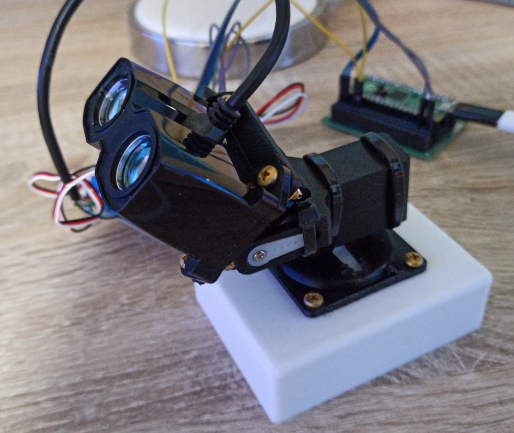
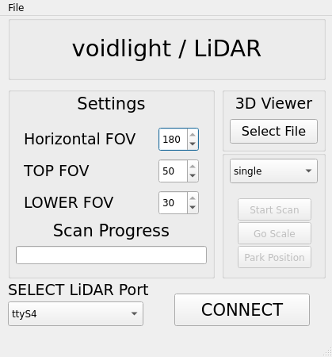
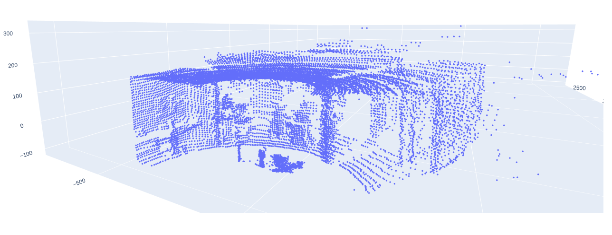
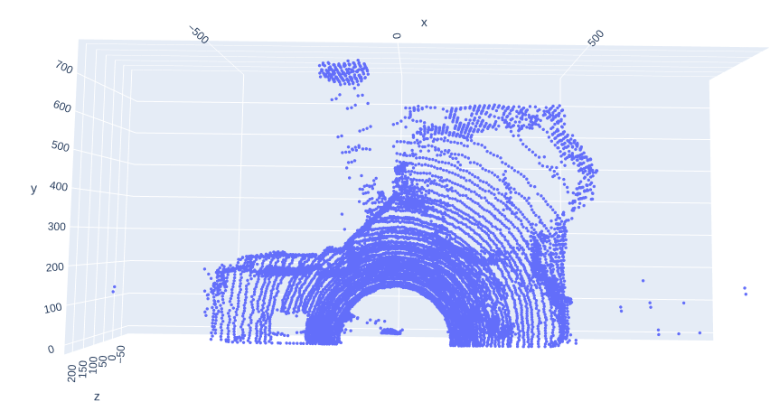
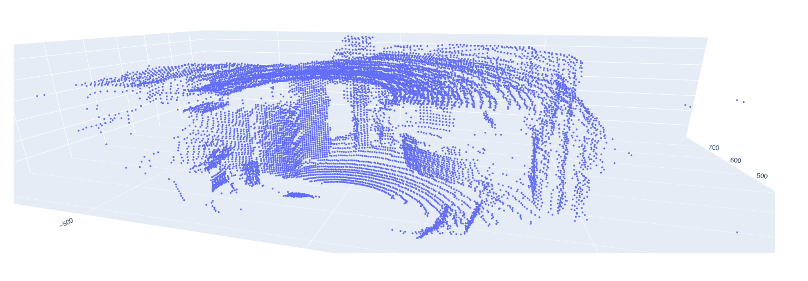

# Servo LiDAR Scanner

## INFO

A lidar 3d scanner built for lidar lite (HP) units. It takes one measurement per angle and calculates them into a 3d grid. It uses two SG90 servo motors for moving along X and Y axis.

The project includes firmware + software (GUI) and build instructions.

**DEMOS** (3D Web View):

* [room.fscan](https://skipper7718.github.io/lidar_demos/1.html)
* [room2.fscan](https://skipper7718.github.io/lidar_demos/6.html)
* [room_with_mirror_and_door.fscan](https://skipper7718.github.io/lidar_demos/2.html)
* [humans_fast_scan.fscan](https://skipper7718.github.io/lidar_demos/3.html)
* [room_quad_mode.fscan](https://skipper7718.github.io/lidar_demos/4.html)
* [stairs_and_hall.fscan](https://skipper7718.github.io/lidar_demos/5.html)

---

## INSTRUCTIONS

## 1. Assembly

I have 3D printed the arm from a model by [@fbuenonet on thingiverse](https://www.thingiverse.com/thing:708819). After that I just drilled holes to mount the Lidar Lite, they fit perfectly into the edges.


## 2. Connecting

Connect LiDAR and servos as following:
| LiDAR / Servos | PICO |
| - | - |
| 5V (servos and LiDAR) | VBUS |
| GND | GND |
| SDA LiDAR | GP16 |
| SCL LiDAR | GP17 |
| Servo X | GP18 |
| Servo Y | GP19 |

I have added a breakout board with capacitors and some resistors to add stability and ease of use.
> TODO: schematic of breakout board

## 3. Firmware

To build the fimware for a RP2040 controller you need the pico SDK and the cmake toolchain.

`mkdir build && cd build && cmake .. && make`

A `lidar.uf2` executable will be built and to flash it, just hold down the BOOTSEL button on the Pi Pico and drag the uf2 file to the flash drive.

## 4. Establishing connection

If everything is connected right and the firmware is flashed, the Pico should appear as a serial device, e.g. `/dev/ttyACM0` on Linux or `COM6` on windows. Note that these may vary depending on which system you are using. Run `lidar_3d_gui/main.py`, select the correct LiDAR port (baud rate is already set to 115200) and click connect. You will see a success dialog indicating that the sensor is connected properly.

Note: When you reboot the device or disconnect it, you have to restart the software.

## 5. The Software

### Settings

Horizontal FOV: maximum horizontal scan angle is hardcoded to 180°, as the servos I used and the ones fitting into the case only have a range of 0° - 180°

TOP / LOWER FOV: The field of view over or under the middle position. They are hardcoded to limited values because else the sensor and motors can be damaged when going into the construction.

### 3D Viewer

You may select an already recorded `.fscan` file and plot it in your browser.

### Scan Tab

In the first box you can either select single or quad mode:

* single: In single mode one measurement is taken per angle
* quad: In quad mode 4 measurements are taken per angle and the average is calculated. This mode results in better quality scans and a sharper image overall, but the scan time is a lot longer. Not recommended for test scans

I will quickly explain the buttons underneath:

1. Start Scan: run full scan wil FOV settings from settings tab. Save the finished `.fscan` file at specified location.
2. Go Scale: Move the motors along an outline of the area to be scanned. Basically only useful when a visible laser diode is attached to the device to get an overview of the area to be scanned.
3. Park Position: In my setup, the sensor had a big overhang before it. In Park Position the sensor will move up left and reboot into BOOTSEL mode. The desktop application will shut down.

### Scan Progress

I don't think I have to add to this one

---

## Using the regular LiDAR Lite v3 sensor

The configuration for the LiDAR Lite v3 **HP** is written in `lidar_lite_v3hp.h`:
```c
#define LIDAR_ACQ_COMMAND			0x00
#define LIDAR_STATUS				0x01
#define LIDAR_SIG_COUNT_VAL			0x02
#define LIDAR_ACQ_CONFIG_REG		0x04
#define LIDAR_LEGACY_RESET_EN		0x06
#define LIDAR_SIGNAL_STRENGTH		0x0e
#define LIDAR_FULL_DELAY_HIGH		0x0f
#define LIDAR_FULL_DELAY_LOW		0x10
#define LIDAR_REF_COUNT_VAL			0x12
#define LIDAR_UNIT_ID_HIGH			0x16
#define LIDAR_UNIT_ID_LOW			0x17
#define LIDAR_I2C_ID_HIGH			0x18
#define LIDAR_I2C_ID_LOW			0x19
#define LIDAR_I2C_SEC_ADDR			0x1a
#define LIDAR_THRESHHOLD_BYPASS		0x1c
#define LIDAR_I2C_CONFIG			0x1e
#define LIDAR_PEAK_STACK_HIGH_BYTE	0x26
#define LIDAR_PEAK_STACK_LOW_BYTE	0x27
#define LIDAR_COMMAND				0x40
#define LIDAR_HEALTH_STATUS			0x48
#define LIDAR_CORR_DATA				0x52
#define LIDAR_CORR_DATA_SIGN		0x53
#define LIDAR_POWER_CONTROL			0x65
```

**To use other LiDAR Lite models** replace the hex values with corresponding ones in the datasheet.

## Screenshots



---




